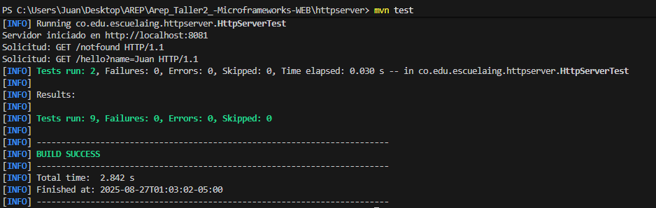

# Servidor HTTP y Mini Framework en Java
Este proyecto implementa un servidor HTTP en Java puro que funciona como un mini framework web.

Permite:

    * Servir archivos estáticos (HTML, CSS, JS, imágenes).
    * Definir endpoints REST con Java lambdas.
    * Manejar parámetros de consulta (?name=Pedro).

## Arquitectura del prototipo

El proyecto está dividido en los siguientes módulos:

- **HttpServer**
    * Maneja las conexiones entrantes con ServerSocket.
    * Registra rutas con get(path, handler).
    * Devuelve respuestas dinámicas (REST) o archivos estáticos.

- **HttpRequest**
    * Se encarga de procesar la URL solicitada.
    * Extrae los parámetros de consulta (query params).

- **HttpResponse**
    * Permite definir el tipo de respuesta (ej. text/html, application/json).

- **WebApplicatio**
    * Ejemplo práctico de uso del framework.
    * Define endpoints /hello, /sum y /pi.
    * Configura la carpeta de archivos estáticos (webroot/public).

## Comenzando

Sigue las siguiente instrucciones para que te permitirán obtener una copia del proyecto en funcionamiento en tu máquina local.

- **Prerrequisitos**

Necesitas tener instalado:

    Java 8 o superior
    Maven

## Instalación

Pasos para ejecutar el servidor en tu entorno local:

- **Clonar el repositorio**
    git clone https://github.com/Enigmus12/Arep_Taller2_-Microframeworks-WEB.git

- **Compilar el proyecto**
    mvn clean install

- **Ejecutar el servidor**
    mvn exec:java

## Estructura del proyecto

```plaintext
src/
 └── main/java/co/edu/escuelaing/
     ├── httpserver/
     │   ├── HttpRequest.java
     │   ├── HttpResponse.java
     │   └── HttpServer.java
     │
     └── webexample/
         └── WebApplication.java

 └── test/java/co/edu/escuelaing/
    └── httpserver/
        ├── HttpRequestTest.java
        ├── HttpResponseTest.java
        └── HttpServerTest.java

webroot/
 └── public/
     ├── index.html
     ├── style.css
     ├── script.js
     └── images/
```


## Endpoints disponibles

    http://localhost:8080/index.html → Sirve la página principal desde webroot/public.

    http://localhost:8080/hello?name=Pedro → Devuelve un JSON con un saludo.

    http://localhost:8080/sum?x=10&y=5 

    http://localhost:8080/pi

## Cómo correr los tests
    * mvn test

   


## Autor
    Juan David Rodriguez Rodriguez
